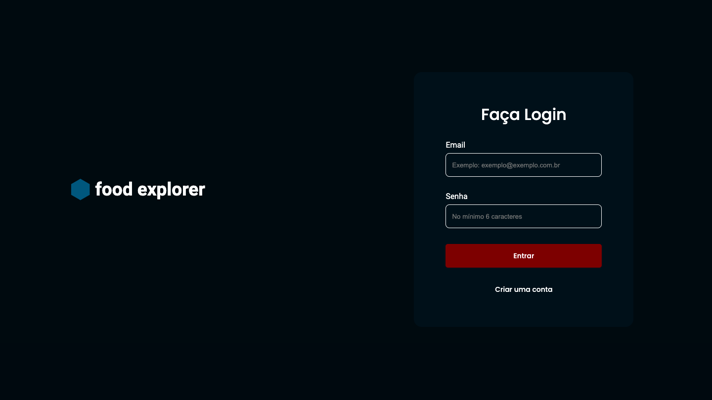
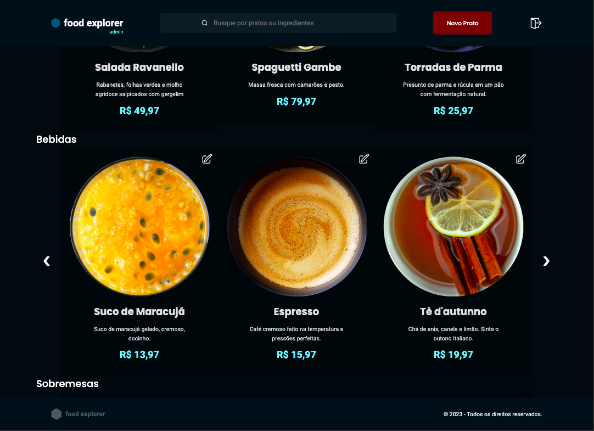

# [Food Explorer - Cardápio Digital](https://foodexplorer-danielvalmeida91.netlify.app)

## Images

<div align="center">
  
</div>

<div align="center">
  
</div>

## Installation (after download project [here](https://github.com/danielvalmeida91/food-explorer.git))

```bash
npm install
```

## Technologies

- [React](https://pt-br.reactjs.org/)
- [Styled-Components](https://styled-components.com/)
- [React-Icons](https://react-icons.github.io/react-icons/)
- [react-elastic-carousel](https://www.npmjs.com/package/@itseasy21/react-elastic-carousel)
- [hamburger-react](https://hamburger-react.netlify.app/)
- [Axios](https://axios-http.com/ptbr/docs/urlencoded)
- [PM2](https://pm2.keymetrics.io/)

## Next steps

- Orders
- Payments

## Deploy

- [Front End](https://www.netlify.com/)
- [Backend](https://render.com/)
- [Full Application](https://foodexplorer-danielvalmeida91.netlify.app)

## Contact Me

- [Instagram](https://www.instagram.com/danielvalmeida91)
- [LinkedIn](https://www.linkedin.com/in/danielvalmeida91)
- [Email](mailto:danielvalmeida91@gmail.com)
